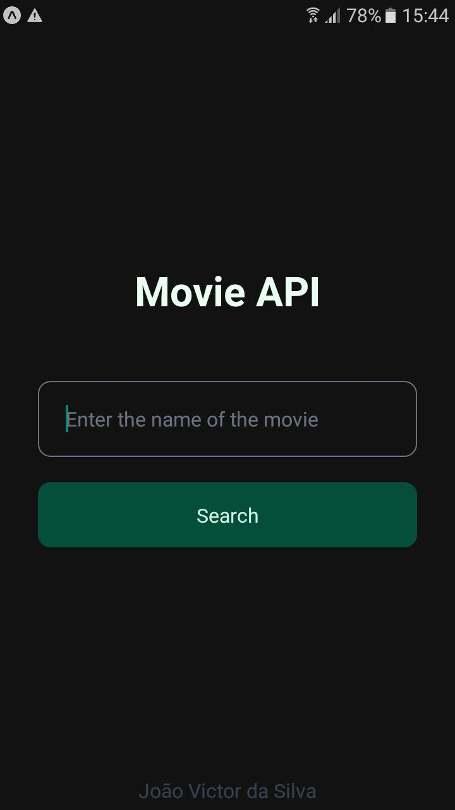

<h1 align="center">Film API consumption - PAMII</h3>

---

> Application created with Expo. API consumption training with React Native

 

  <a href="#sobre">About</a> •
  <a href="#tecno">technologies</a>

 
<h2 id="sobre">:point_right: About</h2>

  This APP was created for the learning and training of API's consumption with React Native. 3° year class in Systems Development at ETEC of Peruíbe - Discipline of PAM II (Programação de Aplicativos Mobile II).

<h2 id="tecno">:wrench: technologies</h2>

- [React Native](https://reactnative.dev/)
- [TypeScript](https://www.typescriptlang.org/)
- [Styled-Components](https://styled-components.com/)
- [Expo](https://expo.io/)
- [React Navigation](https://reactnavigation.org/)
- [API - OMDb API](https://www.omdbapi.com/)

  
  

